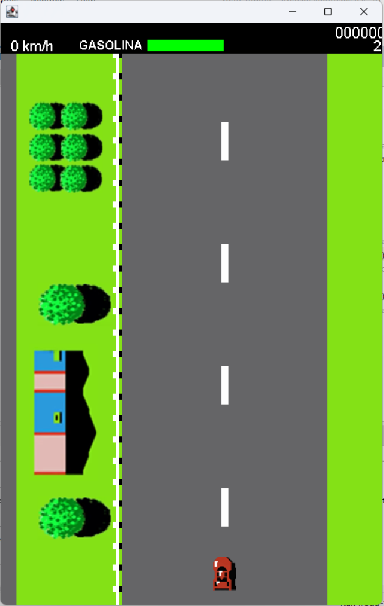
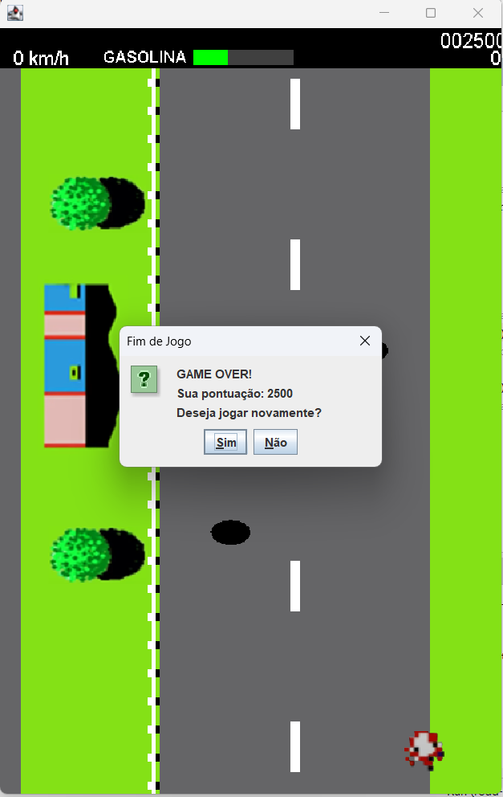

# 🏎️ Road Fighter - Java Edition

Um clone do clássico jogo de Arcade "Road Fighter" (Konami/Nintendo), totalmente desenvolvido em **Java**. Este projeto foi criado com foco em aplicar conceitos sólidos de Programação Orientada a Objetos (POO), gerenciamento de estado e manipulação de interface gráfica.

## 🚀 Principais Desafios e Funcionalidades

Durante o desenvolvimento, a estrutura original do jogo foi refatorada e expandida para incluir mecânicas fiéis ao fliperama:

*   **Game Loop Customizado (60 FPS):** Separação estrita entre lógica de *Setup* e *Renderização* (método `paint`), eliminando problemas de *flickering* (cintilação) da janela e garantindo fluidez no movimento da pista.
*   **Inteligência Artificial de Perseguição:** Inimigos agressivos que calculam a distância no eixo Y e realizam manobras no eixo X para bloquear a passagem do jogador.
*   **Sistema de Combustível Dinâmico:** Consumo atrelado à velocidade da pista, exigindo que o jogador colete recargas (UpCars) geradas por sorteio (RNG) para continuar vivo.
*   **Física de Colisão e Derrapagem:** Sistema de caixas de colisão (Hitboxes) interagindo com carros inimigos e poças de óleo, gerando perda de controle lateral e decréscimo de velocidade.
*   **Sistema de Combo (Bônus):** Contador contínuo de "direção perfeita" que recompensa o jogador com 1000 pontos após um tempo específico sem sofrer danos.

## 🛠️ Tecnologias Utilizadas

*   **Linguagem:** Java
*   **Bibliotecas Gráficas:** Java AWT (Graphics2D) e Swing (JFrame)
*   **Paradigma:** Orientação a Objetos (Herança, Encapsulamento, Modificadores de Acesso)
*   **Controle de Concorrência:** `CompletableFuture` para o motor de Game Loop e temporizadores assíncronos de *Respawn*.

## 🎮 Como Jogar

1. Clone este repositório.
2. Abra o projeto na sua IDE favorita (NetBeans, Eclipse, IntelliJ).
3. Execute a classe `RoadFighter.java`.
4. **Controles:** 
   * `Seta para Cima`: Acelerar
   * `Setas Direita/Esquerda`: Mover o carro
   * `C`: Alternar cor do cenário (Cidade/Praia)

## Screenshots

